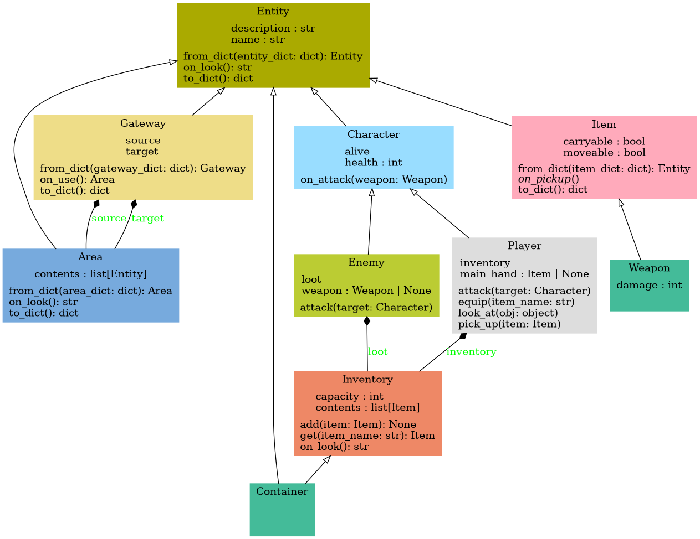

# class model



This class diagram was created using [pyreverse](https://pylint.pycqa.org/en/latest/pyreverse.html) which is a part of `pylint`. Use the command `pyreverse -o png -A *.py` to replicate.

## Entity

An entity is an abstract object in the game world. This class serves as a template for other classes. Each entity has a name and a description.

```python
class Entity():
  name: str
  description: str
```

## Area

An area describes the game area in which the player is currently located. All entities that are currently available to the player are listed in this area. You could also refer to the area as a level.

```python
class Area(Entity):
  name: str  # inherited from Entity
  description: str  # inherited from Entity
  contents: list[Entity]
```

## Character

A character is a living figure in the game world. The character class inherits from the entity class. Each character has health points.

```python
class Character(Entity):
  name: str  # inherited from Entity
  description: str  # inherited from Entity
  health: int
  alive: bool
```

## Player

This class represents the player and provides certain methods by which the player can interact with the game world.

```python
class Player(Character):
  name: str  # inherited from Entity
  description: str  # inherited from Entity
  health: int # inherited from Character
  alive: bool # inherited from Character
  main_hand: Item
  inventory: Inventory
```

## Enemy

An Enemy is an enemy character that can attack the player. When it dies, the enemy drops loot.

```python
class Enemy(Character):
  name: str  # inherited from Entity
  description: str  # inherited from Entity
  health: int # inherited from Character
  alive: bool # inherited from Character
  weapon: Weapon
  loot: Inventory
```

## Item

An item is an entity that can be picked up and moved by the player.

```python
class Item(Entity):
  name: str  # inherited from Entity
  description: str  # inherited from Entity
  moveable: bool
  carryable: bool
```

## Weapon

A weapon is an item that can cause damage to the player or other characters.

```python
class Weapon(Item):
  name: str  # inherited from Entity
  description: str  # inherited from Entity
  moveable: bool  # inherited from Item
  carryable: bool  # inherited from Item
  damage: int
```

## Gateway

A gateway forms a connection between two areas. Gateways are used by the player to get from one room to another. Gateways are also entities in the game world.

```python
class Gateway(Entity):
  name: str  # inherited from Entity
  description: str  # inherited from Entity
  source: area
  target: area
```

## Inventory

An inventory is a collection of items. Each inventory can only store a certain number of items.

```python
class Inventory:
  capacity: int
  contents: list[Item]
```

## Container

A container is an entity in the game world that can contain items, for example a chest or a cupboard. This class therefore inherits from both the Entity class and the Inventory class.

```python
class Container(Entity, Inventory):
  name: str  # inherited from Entity
  description: str  # inherited from Entity
  capacity: int  # inherited from Inventory
  contents: list[Item]  # inherited from Inventory
```

- Key (planned)
- Currency (planned)
